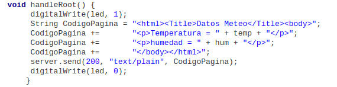

# Internet de las cosas: IOT

@Granabot  2018

José Antonio Vacas @javacasm

## https://github.com/javacasm/IOT_Granabot

## [Introducción a Internet de las Cosas](IOT.md) (IOT)

## [Qué es IOT](https://es.wikipedia.org/wiki/Internet_de_las_cosas)

(De Drawed by Wilgengebroed on Flickr - Translated by Prades97, CC BY-SA 3.0, https://commons.wikimedia.org/w/index.php?curid=32745149)

## Algunos ejemplos:

* Pulsera para medir la actividad física
  * Su batería dura unos ¡¡¡30 días!!!
  * Almacena sus datos (en local) y cuando puede se sincroniza (guardando datos en la nube).
  * Sólo proporciona información que luego vemos en otros dispositivos.
* Sistema de riego inteligente
  * Un arduino que mide la humedad y decide si activar o no una bomba de agua es una prueba de concepto
  * Sistema de riego para una instalación de gran tamaño:
    * Cientos/miles de sensores de humedad
    * Multitud de puntos de riego (válvulas/bombas)
    * Hacemos un datamining sobre los datos de humedad y se activan los puntos de riego

### Internet Of Things

#### But, Which things?

#### EveryThing!!!

¿Recuerdas el cambio de IPV4 a IPV6?

### ¿Quién trabaja con IOT?

[[Informe]](http://mattturck.com/iot2018/) [[Detalles]](http://mattturck.com/wp-content/uploads/2018/02/2018_Matt_Turck_IoT_Landscape_Final.png)

#### Por ejemplo Xiaomi

### ¿Algún dispositivo Maker?

#### Sonoff (Itead Studio)

[Tutorial sobre Sonoff de @programarfacil](https://programarfacil.com/esp8266/domotica-sonoff-wifi-espurna/)

### Qué le pedimos al IOT

* Inteligencia:
    * [Niveles](http://www.domodesk.com/a-fondo-que-es-el-internet-de-las-cosas): identidad, ubicación, estado, contexto, criterio. Ejemplo: los cientos de sensores de humedad de una gran explotación. Un nivel más de Inteligencia sería incluir predicción (por ejemplo la atmosférica: si sabemos a que va llover, esperamos antes de regar)
* Arquitectura
  * [Protocolos](http://www.domodesk.com/a-fondo-que-es-el-internet-de-las-cosas): Cable, Wifi, Zigbee, bluetooth, GSM (y todas sus Gs), ...
  * M2M: Comunicación Machine To Machine
    * Un drone recoge datos del nivel de suciedad de los paneles solares.
    * Envía los datos  a la central
    * Cuando el nivel es el adecuado se activa el robot de limpieza en determinada zona

## [LoraWAN](https://es.wikipedia.org/wiki/LoRaWAN)

[Tutorial @bricolabs](https://bricolabs.cc/wiki/guias/lora_ttn)

## ¿Cómo hacerse un IOT?

## [Arquitectura de un sistema completo IOT](https://polaridad.es/grafica-sensor-internet-de-las-cosas-iot/#estructura-html-grafica-svg)

(Imagen cortesia de Victor Ventura - https://polaridad.es/grafica-sensor-internet-de-las-cosas-iot/#estructura-html-grafica-svg)

## Ejemplos sencillos

[Sensores de temperatura online](http://geek.adachsoft.com/home/article/id/1/n/ESP8266-and-multiple-temperature-sensors-DS18b20-with-HTTP-server)

https://github.com/wemos/D1_mini_Examples/tree/master/examples/01.Basics
https://www.wemos.cc/product/relay-shield.html

## Modelos

### Familia del ESP [Variedades](https://frightanic.com/iot/comparison-of-esp8266-nodemcu-development-boards/)

* ESP8266

  
* NodeMCU

  

* [ESP32](https://en.wikipedia.org/wiki/ESP32)

[Comparativa ESP8266 vs ESP32](http://blog.bricogeek.com/noticias/electronica/comparativa-y-analisis-completo-de-los-modulos-wifi-esp8266-y-esp32/)

Mi elección a día de hoy: [Wemos](https://github.com/javacasm/WeMos_ESP8266)

### ¿Puedo usar arduino?

[SI](https://programarfacil.com/esp8266/como-programar-nodemcu-ide-arduino/)

[¿Cómo se hace?](https://github.com/javacasm/ESP-Tutorial)

[Ejemplos](https://github.com/javacasm/ESP-Tutorial/blob/master/Referencias.md)

[Usando ESP8266](https://github.com/javacasm/ESP8266_Tutorial)

[Usando NodeMCU](https://github.com/javacasm/NodeMCU-tutorial)

* Uso de placa wifi [NodeMCU](./NodeMCU.md) y el [shield de motores](./MotorShield.md) con el [IDE de Arduino](./ConfiguracionIDE.md)
* Familias del ESP8266

### Prácticas
* [Instalación de soporte para las placas ESP8266 en el IDE de Arduino](./ConfiguracionIDE.md)
* [Driver CP210x para Windows](https://www.silabs.com/products/development-tools/software/usb-to-uart-bridge-vcp-drivers) ([Alternativo](https://www.silabs.com/documents/public/software/CP210x_Windows_Drivers.zip))
* Ejemplo de parpadeo led: Ejemplo Blink (D0 o D4)

  Usaremos el ejemplo Blink (Archivo-> Ejemplos -> 1.Basics -> Blink) para hacer que parpadee el led incluido en la placa NodeMCU

  Vemos que el código en versiones modernas del IDE (1.8.x) se refiere al led como LED_BUILTIN, que equivaldrá a un led distinto en cada tipo de placa.
  En nuestro caso según el fabricante será D0 o D4

* Ejemplo de servidor web: Ejemplo ESP8266 WebServer:HelloServer
  Usaremos el ejemplo de servidor web: Ejemplo ESP8266 WebServer:HelloServer

  Debemos incluir el ssid y el password de nuestro wifi que se usarán en el setup para configurar la conexión wifi

  Vemos que existen funciones que se encargan de manejar cada URL

    handleRoot() maneja la URL razi
    handleNotFound() es la que envía el mensaje de error 404 de página no encontrada

  En la siguiente sesión lo integraremos con el código del sensor DHT para publicar los datos de temperatura y humedad
  * Adaptación al NodeMCU de la estación meteorológica con wifi con publicación online de datos

## Sesión 5 15-Marzo
* Estación meteorológica con NodeMCU
* LCD y sensor DHT
* Publicación de datos via WebServer

## Prácticas

  * LCD ([Libreria LCD I2C para ESP](codigo/ESP8266-I2C-LCD1602.zip)) (La que usábamos para Arduino no es compatible)

  

    * Descargamos el zip
    * Lo importamos desde Programa->Incluir Librería -> Importar fichero ZIP
    * Usaremos el ejemplo HelloWorld de la librería ESP8266-I2C-LCD1602

  * DHT Usaremos la librería SimpleDHT que si es compatible con Arduino y con el ESP

  

      * Usamos el ejemplo DHT22Default o el DHT11Default según el sensor usado (DHT22 o DHT11)
      **Cambiamos el pin del ejemplo al D2**

  * Estación meteorológica: mostramos los datos de temperatura y humedad del sensor DHT en el LCD

      * Integramos los 2 ejemplos anteriores:
          * Variables e includes
          * Contenido de los setup
          * Contenido del bucle loop

       [Código](./codigo/Estacion_Meteorologica/Estacion_Meteorologica.ino)

 * Publicación de datos via Web:A

     * Usaremos el ejemplo ESPWebServer->HelloServer
     * Vamos a modificarlo para que incluya los datos del sensor:

     

        void handleRoot() {
             digitalWrite(led, 1);
             String CodigoPagina = "<html><Title>Datos Meteo</Title><body>";
             CodigoPagina +=       "
Temperatura = " + temp + "
";
             CodigoPagina +=       "
humedad = " + hum + "
";
             CodigoPagina +=       "</body></html>";
             server.send(200, "text/plain", CodigoPagina);
             digitalWrite(led, 0);
            }

[Código](./codigo/ESP_MeteoServer/ESP_MeteoServer.ino)

## Ejemplos
* Control de dispositivos via Wifi:
  * [Relé controlado via web](./codigo/ControlRelesWeb) [(ZIP)](./codigo/ControlRelesWeb.zip)

  

* [Configuración de router, ip públicas, etc](./routers.md)

* Protocolos de envio de datos (REST, MQTT)

### API Rest

https://www.smashingmagazine.com/2018/01/understanding-using-rest-api/

https://www.prometec.net/esp8266-subir-valores/

### MQTT

[Botón MQTT](http://kaizoku.azurewebsites.net/2018/01/15/iot-button-part-1-arduino-mqtt-client)

Servidor

    mosquitto

Subscripción

    mosquitto_sub -t "casa/habitaciones/#" -v -A 192.168.1.7

Publicación

    mosquitto_pub -t "casa/habitaciones/hab2/luz" -m "ON" -A 192.168.1.7

    #  casa/habitaciones/hab2/luz ON

[Tutorial](https://ricveal.com/blog/primeros-pasos-mqtt/)

#### https://thingsboard.io (MQTT)

https://thingsboard.io/docs/samples/esp8266/temperature/#step-2-install-arduino-libraries

Instalar mosquito

https://programarfacil.com/esp8266/mqtt-esp8266-raspberry-pi/

## Publicación

### Servidor propio

[Crear servidor en Raspberry](https://www.prometec.net/raspberry-pi-servidor/)

[Abrir servidor web a internet](https://www.prometec.net/raspberry-servidor-internet/)

#### Codigo

     WiFiClient client;
     const int httpPort = 80;
     if (!client.connect(host, httpPort)) {
         Serial.println("connection failed");
         return;
     }

     // We now create a URL for the request
     String url = "/dht11.php";
     String key = "?pass=1234";
     String dato1 = "&Temperatura=";
     String dato2 = "&Humedad=";

     Serial.print("Requesting URL: ");
     Serial.println(url);

     // This will send the request to the server
     client.print(String("GET ") + url + key + dato1 + temp + dato2 + hum + " HTTP/1.1\r\n" +
     "Host: " + host + "\r\n" +
     "Connection: close\r\n\r\n");
     unsigned long timeout = millis();
     while (client.available() == 0) {
         if (millis() - timeout > 5000) {
            Serial.println(">>> Client Timeout !");
            client.stop();
            return;
         }
     }

     * Plataformas online ( Blink, Cayenne, Thingspeak, Thinger.io, etc.)

#### https://thingspeak.com     

https://www.instructables.com/id/IoT-ESP8266-Series-2-Monitor-Data-Through-ThingSpe/

## http://cayenne.com

Usa MQTT

[Tutorial](https://programarfacil.com/blog/arduino-blog/cayenne-mydevices-arduino-sensores-iot/)

* WifiManager: Librería
* Hora via [NTP](./codigo/NTP) Ejemplo que nos permite recuperar la hora actual via Internet
* [Proyectos con varios ficheros](ProyectoVariosFicheros/README.md)
