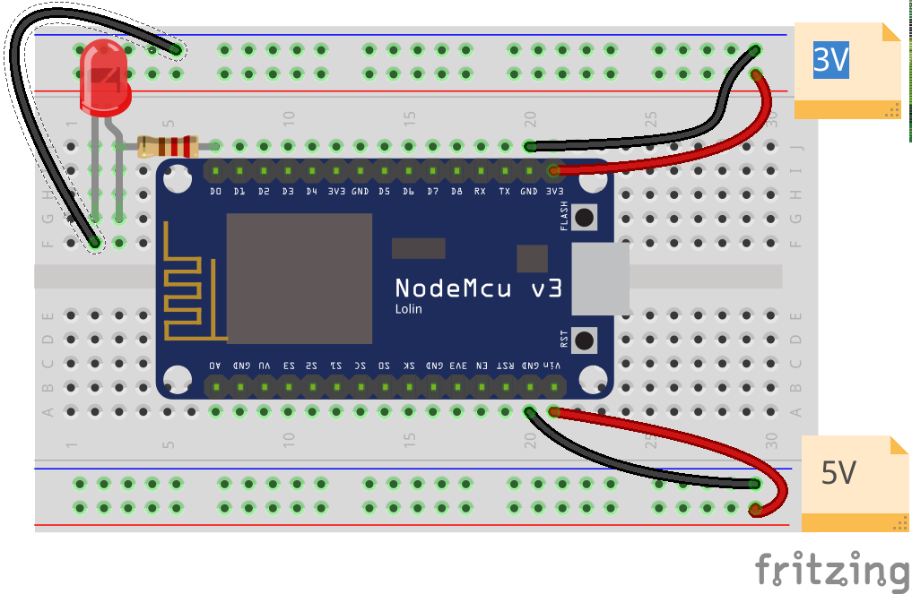
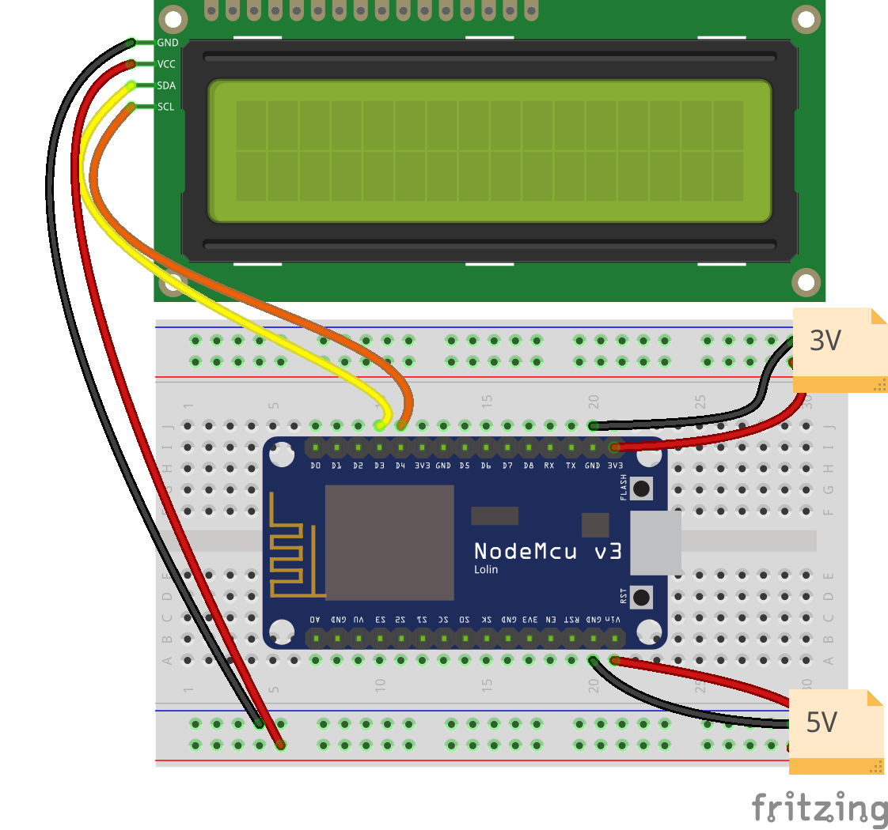
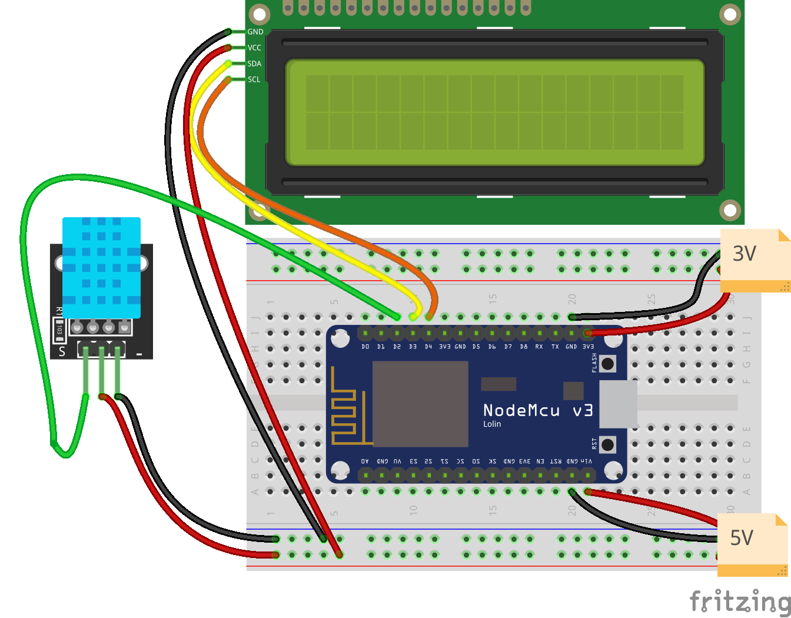
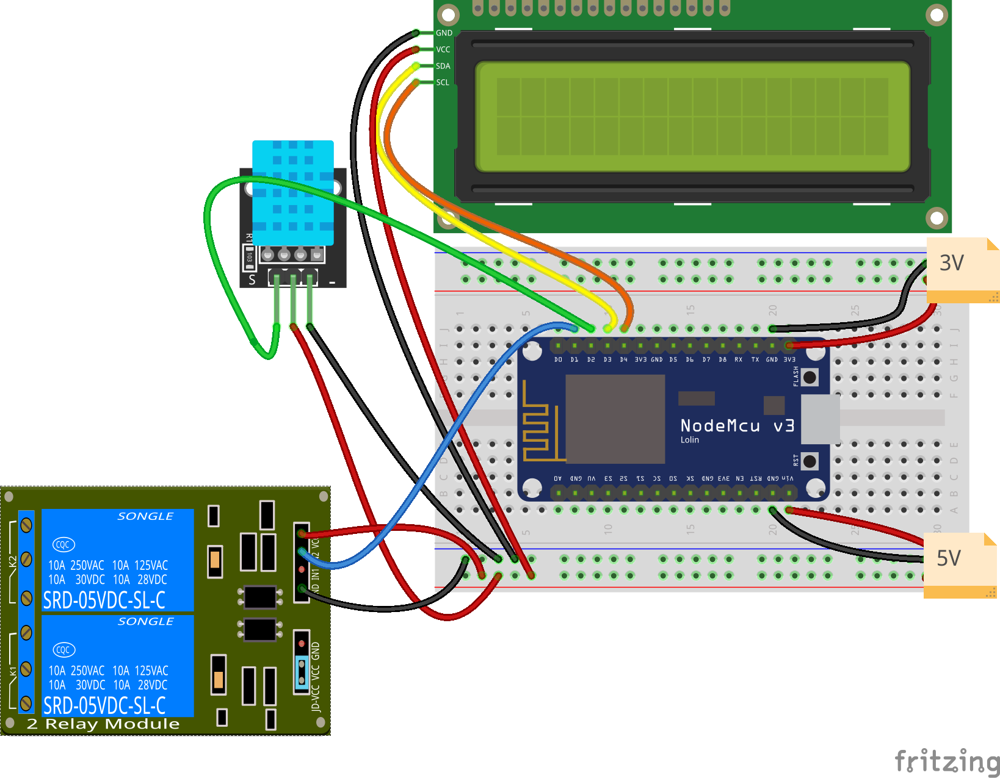
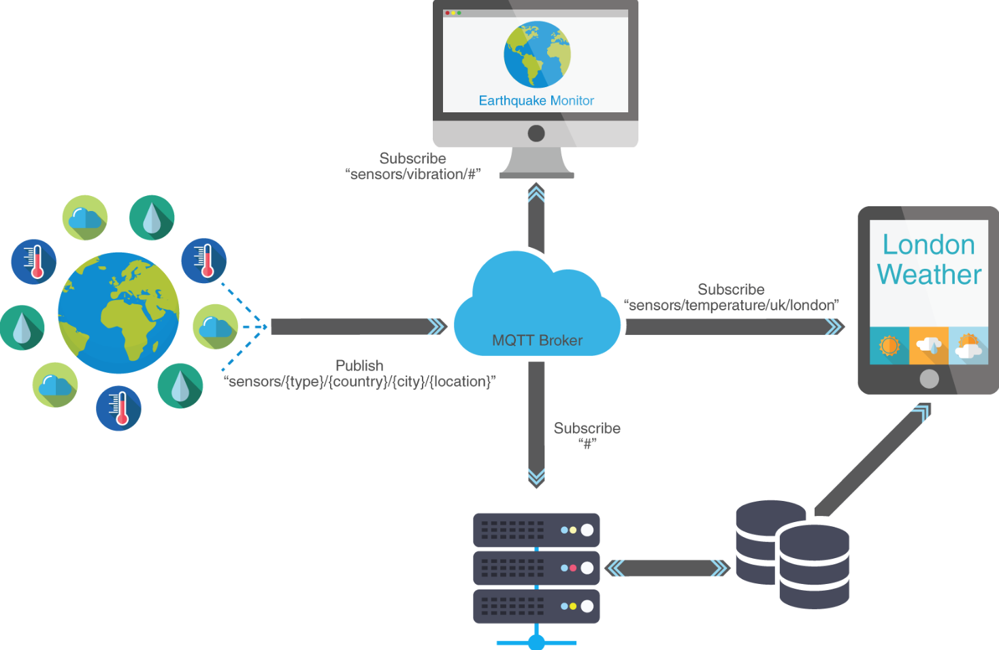

# Internet de las cosas: IOT

@Granabot  2018

José Antonio Vacas @javacasm

## https://github.com/javacasm/CharlaIOTGranabot-

* [Introducción a Internet de las Cosas](IOT.md) (IOT)
* Uso de placa wifi [NodeMCU](./NodeMCU.md) y el [shield de motores](./MotorShield.md) con el [IDE de Arduino](./ConfiguracionIDE.md)
* Familias del ESP8266

### Prácticas
* [Instalación de soporte para las placas ESP8266 en el IDE de Arduino](./ConfiguracionIDE.md)
* [Driver CP210x para Windows](https://www.silabs.com/products/development-tools/software/usb-to-uart-bridge-vcp-drivers) ([Alternativo](https://www.silabs.com/documents/public/software/CP210x_Windows_Drivers.zip))
* Ejemplo de parpadeo led: Ejemplo Blink (D0 o D4)

  Usaremos el ejemplo Blink (Archivo-> Ejemplos -> 1.Basics -> Blink) para hacer que parpadee el led incluido en la placa NodeMCU

  Vemos que el código en versiones modernas del IDE (1.8.x) se refiere al led como LED_BUILTIN, que equivaldrá a un led distinto en cada tipo de placa.
  En nuestro caso según el fabricante será D0 o D4

* Ejemplo de servidor web: Ejemplo ESP8266 WebServer:HelloServer
  Usaremos el ejemplo de servidor web: Ejemplo ESP8266 WebServer:HelloServer

  Debemos incluir el ssid y el password de nuestro wifi que se usarán en el setup para configurar la conexión wifi

  Vemos que existen funciones que se encargan de manejar cada URL

    handleRoot() maneja la URL razi
    handleNotFound() es la que envía el mensaje de error 404 de página no encontrada

  En la siguiente sesión lo integraremos con el código del sensor DHT para publicar los datos de temperatura y humedad
  * Adaptación al NodeMCU de la estación meteorológica con wifi con publicación online de datos

## Sesión 5 15-Marzo
* Estación meteorológica con NodeMCU
* LCD y sensor DHT
* Publicación de datos via WebServer

## Prácticas

  * LCD ([Libreria LCD I2C para ESP](codigo/ESP8266-I2C-LCD1602.zip)) (La que usábamos para Arduino no es compatible)

  

    * Descargamos el zip
    * Lo importamos desde Programa->Incluir Librería -> Importar fichero ZIP
    * Usaremos el ejemplo HelloWorld de la librería ESP8266-I2C-LCD1602

  * DHT Usaremos la librería SimpleDHT que si es compatible con Arduino y con el ESP

  

      * Usamos el ejemplo DHT22Default o el DHT11Default según el sensor usado (DHT22 o DHT11)
      **Cambiamos el pin del ejemplo al D2**

  * Estación meteorológica: mostramos los datos de temperatura y humedad del sensor DHT en el LCD

      * Integramos los 2 ejemplos anteriores:
          * Variables e includes
          * Contenido de los setup
          * Contenido del bucle loop

       [Código](./codigo/Estacion_Meteorologica/Estacion_Meteorologica.ino)

 * Publicación de datos via Web:A

     * Usaremos el ejemplo ESPWebServer->HelloServer
     * Vamos a modificarlo para que incluya los datos del sensor:

        void handleRoot() {
             digitalWrite(led, 1);
             String CodigoPagina = "<html><Title>Datos Meteo</Title><body>";
             CodigoPagina +=       "
Temperatura = " + temp + "
";
             CodigoPagina +=       "
humedad = " + hum + "
";
             CodigoPagina +=       "</body></html>";
             server.send(200, "text/plain", CodigoPagina);
             digitalWrite(led, 0);
            }

    [Código](./codigo/ESP_MeteoServer/ESP_MeteoServer.ino)

## Sesión 6 10-Abril
* Control de dispositivos via Wifi:
  * [Relé controlado via web](./codigo/ControlRelesWeb) [(ZIP)](./codigo/ControlRelesWeb.zip)

  

* [Configuración de router, ip públicas, etc](./routers.md)

* Protocolos de envio de datos (REST, MQTT)

### API Rest

https://www.smashingmagazine.com/2018/01/understanding-using-rest-api/

https://www.prometec.net/esp8266-subir-valores/

### MQTT

[Botón MQTT](http://kaizoku.azurewebsites.net/2018/01/15/iot-button-part-1-arduino-mqtt-client)

Servidor

    mosquitto

Subscripción

    mosquitto_sub -t "casa/habitaciones/#" -v -A 192.168.1.7

Publicación

    mosquitto_pub -t "casa/habitaciones/hab2/luz" -m "ON" -A 192.168.1.7

    #  casa/habitaciones/hab2/luz ON

[Tutorial](https://ricveal.com/blog/primeros-pasos-mqtt/)

#### https://thingsboard.io (MQTT)

https://thingsboard.io/docs/samples/esp8266/temperature/#step-2-install-arduino-libraries

Instalar mosquito

https://programarfacil.com/esp8266/mqtt-esp8266-raspberry-pi/

## Publicación

### Servidor propio

[Crear servidor en Raspberry](https://www.prometec.net/raspberry-pi-servidor/)

[Abrir servidor web a internet](https://www.prometec.net/raspberry-servidor-internet/)

#### Codigo

     WiFiClient client;
     const int httpPort = 80;
     if (!client.connect(host, httpPort)) {
         Serial.println("connection failed");
         return;
     }

     // We now create a URL for the request
     String url = "/dht11.php";
     String key = "?pass=1234";
     String dato1 = "&Temperatura=";
     String dato2 = "&Humedad=";

     Serial.print("Requesting URL: ");
     Serial.println(url);

     // This will send the request to the server
     client.print(String("GET ") + url + key + dato1 + temp + dato2 + hum + " HTTP/1.1\r\n" +
     "Host: " + host + "\r\n" +
     "Connection: close\r\n\r\n");
     unsigned long timeout = millis();
     while (client.available() == 0) {
         if (millis() - timeout > 5000) {
            Serial.println(">>> Client Timeout !");
            client.stop();
            return;
         }
     }

     * Plataformas online ( Blink, Cayenne, Thingspeak, Thinger.io, etc.)

#### https://thingspeak.com     

https://www.instructables.com/id/IoT-ESP8266-Series-2-Monitor-Data-Through-ThingSpe/

## http://cayenne.com

Usa MQTT

[Tutorial](https://programarfacil.com/blog/arduino-blog/cayenne-mydevices-arduino-sensores-iot/)

* WifiManager: Librería
* Hora via [NTP](./codigo/NTP) Ejemplo que nos permite recuperar la hora actual via Internet
* [Proyectos con varios ficheros](ProyectoVariosFicheros/README.md)

### Recursos complementarios

* [Manejo de puertos en paralelo](./Repaso/1.2.1_ProgramacionAvanzadaPuertos.pdf) (Registros)
* [Control de potencia](./Repaso/ElectrónicaPotencia.pdf)
* Control de motores
  * [Motores CC](./Repaso/2.1.4_Motores.pdf)
  * [Paso a paso](./Repaso/stepper.md)
* [Lectura de tarjertas RFID](./RFid.md)
* [Control con Infrarrojos](./Repaso/3.7_Infrarrojos.pdf)
* Lectura de [tiempos (RTC)](./Repaso/4.2_RTC.pdf)
